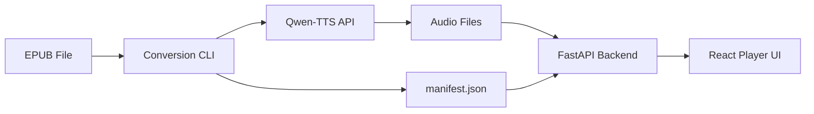

# 🎧 EPUB Audiobook Generator (Qwen-TTS)

<p align="center">
  
  
  
  
  
</p>

**Turn your EPUB library into high-quality audiobooks with the power of Qwen-TTS.**

The EPUB Audiobook Generator is a professional-grade pipeline that converts digital books into chapter-based audio files. By leveraging the Qwen-TTS API, it provides a seamless transition from reading to listening, complete with a modern playback UI and synchronized manifest tracking.

---

## ✨ Key Features

- 📚 **Smart EPUB Parsing**: Automatically extracts chapters, metadata, and cover images.
- 🎙️ **High-Fidelity TTS**: Integrates with Qwen-TTS API for natural, human-like voice synthesis.
- 🧩 **Chunk-based Generation**: Splits text into optimal segments for resumable and stable conversion.
- 🎧 **Modern Playback UI**: A React-based interface for managing your audiobook library and listening on the go.
- ⏱️ **Precise Synchronization**: Generates a `manifest.json` to map audio segments back to the original text.
- 🛠️ **Professional Workflow**: Full support for `pre-commit` hooks, strict typing, and layered architecture.

## 🏗️ Architecture

The system is divided into three main components:

1. **Conversion CLI**: A Python-based tool that handles the "EPUB $\rightarrow$ Audio" pipeline.
2. **Backend API**: A FastAPI server that manages the audiobook library and serves audio files.
3. **Frontend Player**: A Vite + React application for the end-user experience.



## 🚀 Quick Start

### Prerequisites
- Python 3.10+
- Node.js 20+
- `ffmpeg` installed on your system
- A running [Qwen-TTS API Server](https://github.com/sora-kisaragi/qwen-tts-validation)

### 1. Clone and Setup
```bash
git clone https://github.com/sora-kisaragi/audiobooker.git
cd audiobooker

# Setup Backend
python3 -m venv venv
source venv/bin/activate
pip install -r requirements.txt

# Setup Frontend
cd frontend
npm install
```

### 2. Convert an EPUB
```bash
python -m epub_qwen_audiobook convert \
  --epub input/my_book.epub \
  --output output/my_book \
  --tts-url http://localhost:8085 \
  --profile default.pt
```

### 3. Launch the UI
```bash
# Start Backend
uvicorn backend.app.main:app --port 8085

# Start Frontend
cd frontend
npm run dev
```

## 🛠️ Configuration

You can customize the conversion process via the CLI flags or a configuration file:

| Parameter | Description | Default |
|---|---|---|
| `--tts-url` | URL of the Qwen-TTS API server | `http://localhost:8085` |
| `--profile` | Voice profile to use for synthesis | `default.pt` |
| `--language` | Target language for the TTS engine | `japanese` |
| `--chunk-size` | Max characters per audio segment | `500` |

## 🤝 Contributing

Contributions are welcome! Please follow these steps:
1. Fork the repository.
2. Create a feature branch (`git checkout -b feature/AmazingFeature`).
3. Commit your changes (`git commit -m 'Add some AmazingFeature'`).
4. Push to the branch (`git push origin feature/AmazingFeature`).
5. Open a Pull Request.

**Note**: Direct pushes to `main` are prohibited. All changes must go through a PR.

## 📄 License
This project is licensed under the MIT License.
