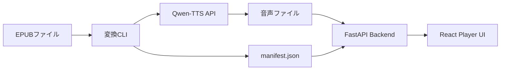

# 🎧 EPUB オーディオブック化ツール (Qwen-TTS)

<p align="center">
  
  
  
  
  
</p>

**Qwen-TTS のパワーを利用して、EPUB ライブラリを高品位なオーディオブックに変換します。**

このツールは、EPUB ファイルを解析し、Qwen-TTS API を介して章ごとの音声ファイルを生成するプロフェッショナルなパイプラインです。生成された音声は専用の再生 UI で管理・視聴でき、マニフェストファイルによってテキストと音声の同期管理を実現します。

---

## ✨ 主な機能

- 📚 **スマート EPUB 解析**: 章立て、メタデータ、表紙画像を自動的に抽出。
- 🎙️ **高品位 TTS**: Qwen-TTS API と連携し、自然で人間らしい音声合成を実現。
- 🧩 **チャンクベース生成**: テキストを最適な長さ（300〜800文字）に分割し、安定した変換と再生成を可能に。
- 🎧 **モダンな再生 UI**: React ベースのインターフェースで、本棚管理からオーディオ再生までをシームレスに提供。
- ⏱️ **精密な同期**: `manifest.json` を生成し、音声セグメントを元のテキストに正確にマッピング。
- 🛠️ **プロフェッショナルな開発フロー**: `pre-commit` フック、厳格な型定義、レイヤードアーキテクチャを採用。

## 🏗️ アーキテクチャ

システムは主に以下の3つのコンポーネントで構成されています。

1. **変換 CLI**: EPUB $\rightarrow$ 音声 への変換を行う Python ツール。
2. **バックエンド API**: オーディオブックライブラリを管理し、音声ファイルを配信する FastAPI サーバー。
3. **フロントエンド プレイヤー**: Vite + React によるユーザー向け再生アプリケーション。



## 🚀 クイックスタート

### 前提条件
- Python 3.10+
- Node.js 20+
- `ffmpeg` がシステムにインストールされていること
- [Qwen-TTS API サーバー](https://github.com/sora-kisaragi/qwen-tts-validation) が稼働していること

### 1. セットアップ
```bash
git clone https://github.com/sora-kisaragi/audiobooker.git
cd audiobooker

# バックエンド環境構築
python3 -m venv venv
source venv/bin/activate
pip install -r requirements.txt

# フロントエンド環境構築
cd frontend
npm install
```

### 2. EPUB の変換
```bash
python -m epub_qwen_audiobook convert \
  --epub input/my_book.epub \
  --output output/my_book \
  --tts-url http://localhost:8087 \
  --profile default.pt
```

### 3. UI の起動
```bash
# バックエンド起動
uvicorn backend.app.main:app --port 8087

# フロントエンド起動
cd frontend
npm run dev
```

## 🛠️ 設定

CLI フラグまたは設定ファイルを通じて変換プロセスをカスタマイズできます。

| パラメータ | 説明 | デフォルト |
|---|---|---|
| `--tts-url` | Qwen-TTS API サーバーの URL | `http://localhost:8087` |
| `--profile` | 音声合成に使用するプロファイル | `default.pt` |
| `--language` | TTS エンジンの対象言語 | `japanese` |
| `--chunk-size` | 1セグメントあたりの最大文字数 | `500` |

## 🤝 貢献方法

貢献を歓迎します！以下の手順に従ってください：
1. リポジトリをフォークする。
2. 機能ブランチを作成する (`git checkout -b feature/AmazingFeature`)。
3. 変更をコミットする (`git commit -m 'Add some AmazingFeature'`)。
4. ブランチを push する (`git push origin feature/AmazingFeature`)。
5. プルリクエストを作成する。

**注意**: `main` ブランチへの直接 push は禁止されています。すべての変更は PR を通じて行ってください。

## 📄 ライセンス
このプロジェクトは MIT ライセンスの下で公開されています。
